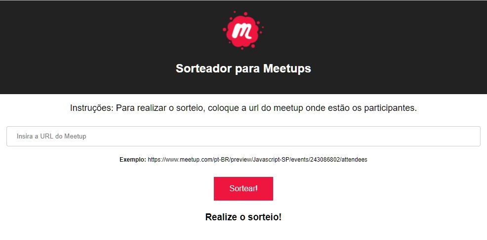

# WebScraping for websites

Developed over the need for information that is on other sites, thus delivering the best to the user.  In _web scraping_ concept. 

## How it`s Work?

Only put a link and we response what type of informations that website has.

## Working

For development 
`npm run start-dev`

Prodution mode:
1. Execute o `npm run build` 
2. Execute o `npm start`
